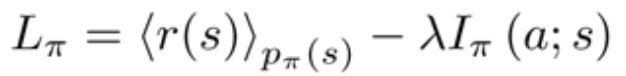
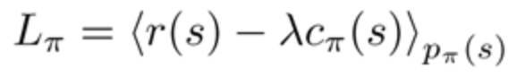

Training and inferring neural network function with multi-agent reinforcement learning
Matthew Chalk
Gasper Tkacik
Olivier Marre
doi: https://doi.org/10.1101/598086

https://www.biorxiv.org/content/10.1101/598086v3

This paper discusses a reinforcement learning-based method to model and replicate the methods of neural circuits.

It's a little specific to neural circuits as opposed to general agent-based problems and I have a lot of questions.

Top-down approach:
 - Observe neural circuits
 - Hypothesize about neural circuits function
 - Test hypothesis experimentally

So, you could look at a neural circuit, attempt to understand the network dynamics, hypothesize that it
 - Initiates motor activity
 - Detects eg predators
 - Remembers stuff

Circuits are hard to understand, it can be hard to hypothesize, circuits don't always act exactly the way you would expect given the hypothesis. If behavior somewhat matches, it's hard to tell if the hypothesis is falsified or the function is not fully understood. (Not 100% sure how you experimentally verify a hypothesis - MRI that shows circuit lights up during e.g. a motor activity?)

Using a bottom-up RL-based approach, you could gather experimental data on a circuit's inputs and outputs, and use inverse RL to derive its implicit reward function.

An example network structure is discussed but I don't fully understand, maybe need to do more work or ask some people familiar.

- Network of e.g. 8 neurons: "we simulated a network of 8 neurons that receive a binary input x (Fig 2A)."
- Presumably all 8 neurons receive this input
- Network seems fully connected
- I'm not sure if the signal sent between neurons is a binary or continuous variable or even vector
- Neuron sends an output to all the other neurons, which is some nonlinear function of all the inputs sent . Nature of nonlinearity eg relu? Is timing a factor? Same signal toward all other neurons or specific to each neuron?
- 'Fire' means equal signal toward all other neurons or some internal state/output?
- Objective is to fire exactly 2 spikes when x = −1, and 6 spikes when x = 1. This means 2/8 neurons should fire when x=-1, and 6/8 neurons should fire when x=-1.
- Reward seems to be a global reward for all the neurons when the behave in the desired way

The network is trained and shown to achieve the desired behavior.

The described network is not mapping exactly to traditional NN/RL framework. The setup seems like a supervised problem, not an RL problem - given an input match a desired output label.

RL = use a supervised learner to choose an action (fire/don't fire) under complex system dynamics like a Space Invaders game, with feedback loops where your action affects future system dynamics.

There are 2 expressions for the reward which is maximized

In each case the first part is the normal RL reward -
 - We parameterize a policy NN to maximize an objective
 - The objective is the average reward per timestep as the agent chooses actions per the policy and follows the (state, action) trajectory implied by the policy
 - We maximize the reward per timestep over the parameter space

The second part is the 'information constraint' or 'coding cost' and is intended to constrain the complexity of the circuit

I don't really understand, the 2 formulations of the coding cost (equations 1 and 2):

This 2nd one has a more precise mathematical explanation, cπ is Kullback-Leibler divergence between the agent’s policy and the steady-state distribution over actions, DKL [π (a|s)‖pπ (a)]. 

KL divergence is generalized cross-entropy betweeen 2 distributions, in bits. In binary cross-entropy it's same as log loss:

- If you predict 100% probability that the label is 1, and the label is in fact 1, it's 0 bits of divergence. (prediction distribution = label distribution = [0% of the time 0, 100% of the time 1] )
- If you predict 50% probability, it's 1 bit of divergence between prediction and label. 
- if you predict 0% probability the target will be 1, and it's 1, that's infinity bits of divergence. 

So, the two things you are comparing are, on the right, pπ (a), the overall % of time you pick 0/1 action (or more complex multinomial classification, vector of outputs etc.), and on the left, π (a|s), the distribution conditioned on states. So the KL divergence represents how many bits you get from the state.

That being said, raises some questions. I think 'inverse RL' would have to extract the coding cost since it determines the output. if the coding cost is very large it doesn't matter what the state is, you just pick actions according to some distribution regardless of state. so then you can't really inverse-RL state parameters, they don't matter.

Also since I'm not really clear on the neural internals or response function, I'm not sure how coding cost actually changes what the neuron is doing.

If you have a low coding cost it should learn encode the form of the maze and solve it efficiently, if you have a high coding cost it should act pretty randomly.

Now this is sort of like the variance/bias tradeoff in machine learning but usually we think about it a little differently in terms of number of parameters in the model and regularization. You try to find the optimal point in the tradeoff, where in e.g. supervised learning, the model predicts best out-of-sample. This is a little like regularization where you pay to use a parameter.

I have to learn more about this coding cost. It seems c-pi of s seems like a thing with a complicated form to optimize.

So then he does a thing where he derives the reward function from the form of the network and experimental data, I think.

Inverse RL assumes you have data on the entire state space. In high dimensional state spaces that is not super feasible. 

I don't think he actually builds the network to solve the maze, and then does inverse RL on experimental data to derive the reward. 

Another interesting point is, suppose you used an actor-critic methodology, tried to derive the reward function from the actions. Are you going to get the actual rewards experienced for a (state, action) tuple? Or are you going to get the critic's evaluation of the (state, action)? I think you get the critic function.

It's possible that it might be an interesting problem to solve a maze with a multi-agent model and then do inverse-RL. Not that clear how to divide the maze problem into multiple agents, it almost seems too simple.

 